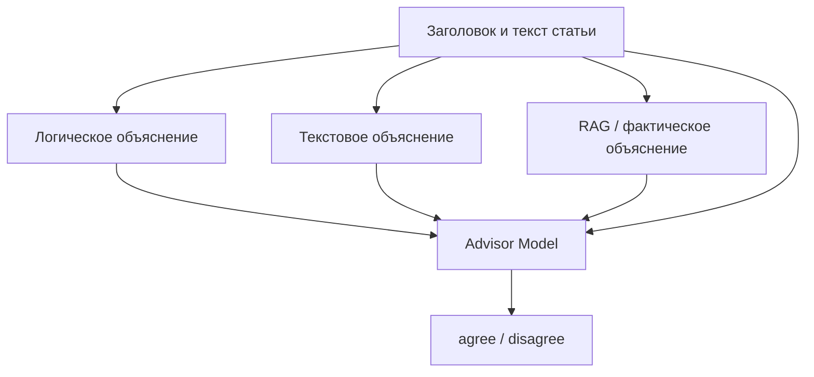

# Advisor Model: классификация новостных заголовков с объяснениями и RAG

Проект классифицирует новостные заголовки как согласующиеся (`agree`, класс `1`) или не согласующиеся (`disagree`, класс `0`) с доступными данными. Перед классификацией для каждого заголовка формируются три независимых объяснения:

1. `evidence_explanation` — фактическое обоснование на основе статьи или RAG-поиска;
2. `commonsense_explanation` — анализ логики и правдоподобности;
3. `textual_explanation` — анализ стиля, эмоциональности и кликбейта.

Заголовок и три объяснения кодируются общей Transformer-моделью. Затем двунаправленный cross-attention объединяет их представления, а классификатор выдаёт итоговый класс.

> **Важно:** в текущей версии исходников есть несколько ошибок и несогласованностей, перечисленных в разделе [Известные проблемы](#известные-проблемы). Перед полным запуском пайплайна их необходимо исправить.

## Состав проекта

| Файл | Назначение |
| --- | --- |
| `bmwGpt2.py` | Индексация документов в ChromaDB и интерактивный гибридный RAG-поиск: векторный поиск + поиск по ключевым словам + Reciprocal Rank Fusion. |
| `generate_explanations.py` | Генерация логического и текстового объяснений для датасета в формате FNC. |
| `generate_rag_explanations.py` | Генерация фактических объяснений с использованием ChromaDB; при недоступности базы использует `articleBody`. |
| `prepare_advisor_dataset.py` | Генерация или объединение объяснений, очистка утечек целевой метки и проверка датасета. |
| `advisor1.py` | Обучение Advisor-модели, валидация и оценка на тестовой выборке. |
| `test_predict.py` | Генерация объяснений, загрузка обученного checkpoint, предсказание и расчёт метрик. |

## Общая схема



## Требования

- Python 3.10 или новее;
- Ollama с загруженной языковой моделью;
- доступ к Hugging Face для первой загрузки `intfloat/multilingual-e5-large`;
- CUDA-совместимая GPU рекомендуется для обучения и генерации, но код умеет работать на CPU;
- достаточно дискового пространства для LLM, Transformer-модели и ChromaDB.

Модель `gpt-oss:120b`, используемая по умолчанию, требует очень много памяти. Если она не помещается на вашем оборудовании, укажите более компактную модель там, где скрипт поддерживает `OLLAMA_MODEL` или параметр `--model`.

## Установка

```bash
python -m venv .venv
source .venv/bin/activate
python -m pip install --upgrade pip
pip install \
  pandas numpy requests tqdm python-dotenv \
  torch transformers scikit-learn colorama \
  chromadb langchain-chroma langchain-ollama langchain-core \
  langchain-text-splitters langchain-huggingface \
  pypdf openpyxl
```

Установите и запустите Ollama, затем загрузите выбранную модель:

```bash
ollama pull gpt-oss:120b
ollama serve
```

## Конфигурация

Создайте файл `.env` в корне проекта:

```dotenv
OLLAMA_HOST=http://localhost:11434
OLLAMA_MODEL=gpt-oss:120b

EMBEDDING_MODEL=intfloat/multilingual-e5-large
CHROMA_DIR=chromadb_gemini
CHROMA_COLLECTION=gov_news_gemini

CHUNK_SIZE=1100
CHUNK_OVERLAP=180
INDEX_BATCH_SIZE=96
BATCH_SLEEP_SEC=62
INDEX_MAX_RETRIES=10

PER_QUERY_K=8
FINAL_K=10
KEYWORD_K=20
MAX_CONTEXT_EVIDENCE=8
RETRIEVAL_SCORE_THRESHOLD=1.55
MIN_EVIDENCE_CHUNKS=2
MIN_RRF_SCORE=0.028
```

`generate_explanations.py` использует жёстко заданные значения `http://localhost:11434/api/generate` и `gpt-oss:120b`. `prepare_advisor_dataset.py` также использует фиксированный адрес Ollama, но имя модели принимает через `--model`.

### TSV-датасет

Для режима `prepare_advisor_dataset.py --generate` ожидается TSV-файл со столбцами:

- `title` — заголовок;
- `is_fake` — числовая метка.

Проверьте семантику `is_fake`: в Advisor-модели класс `1` означает `agree`, тогда как в большинстве датасетов `is_fake=1` означает фейк. При необходимости инвертируйте метки.

### Документы для RAG

Поместите документы в каталог `data/`. Скрипт рекурсивно обрабатывает:

- `.csv` и `.xlsx` — ожидается текстовый столбец с именем `text`, `content`, `body`, `article`, `news`, `txt` или `текст`;
- `.txt`;
- `.pdf` с извлекаемым текстовым слоем.

Для табличных файлов необязательный идентификатор может находиться в столбце `id`, `new_id`, `doc_id`, `document_id` или `news_id`.

## Подготовка RAG-базы

Структура перед индексацией:

```text
project/
├── bmwGpt2.py
├── .env
└── data/
    ├── source.csv
    ├── source.pdf
    └── source.txt
```

Запуск:

```bash
python bmwGpt2.py
```

Если коллекция пуста, документы разбиваются на чанки и сохраняются в `chromadb_gemini/`. После индексации запускается интерактивный режим:

```text
You: ваш вопрос
```

Для выхода введите `exit` или `quit`. Прогресс индексации хранится в `.index_checkpoint.json`, поэтому после сбоя запуск можно продолжить.

## Подготовка обучающего датасета

### Вариант 1: генерация всех объяснений из TSV

```bash
python prepare_advisor_dataset.py \
  --generate \
  --train fakenews_dataset/train.tsv \
  --model gpt-oss:120b \
  --output advisor_dataset_final.csv
```

Для пробного запуска можно ограничить число строк:

```bash
python prepare_advisor_dataset.py \
  --generate \
  --train fakenews_dataset/train.tsv \
  --limit 100 \
  --output advisor_dataset_sample.csv
```

### Вариант 2: отдельная генерация объяснений для FNC

После исправления параметра `--limit` в двух генераторах:

```bash
python generate_explanations.py \
  --stances fakenews/train_stances.csv \
  --bodies fakenews/train_bodies.csv \
  --output final_dataset_for_advisor.csv

python generate_rag_explanations.py \
  --stances fakenews/train_stances.csv \
  --bodies fakenews/train_bodies.csv \
  --output phd_training_dataset_qwen.csv
```

Затем объедините файлы:

```bash
python prepare_advisor_dataset.py \
  --data_a final_dataset_for_advisor.csv \
  --data_b phd_training_dataset_qwen.csv \
  --output advisor_dataset_final.csv
```

Объединение выполняется по позиции строк, а не по идентификатору. Оба файла должны содержать одинаковые примеры в одинаковом порядке.

Итоговый CSV должен содержать:

```text
claim,evidence_explanation,commonsense_explanation,textual_explanation,label
```

Скрипт удаляет некоторые явные токены вердикта из объяснений, проверяет возможную утечку метки и оценивает сложность задачи простым TF-IDF-классификатором.

## Обучение Advisor Model

После исправления `prepare_dataframe()` в `advisor1.py`:

```bash
python advisor1.py \
  --data_a final_dataset_for_advisor.csv \
  --data_b phd_training_dataset_qwen.csv \
  --merge_strategy best \
  --model_name intfloat/multilingual-e5-large \
  --epochs 5 \
  --batch_size 8 \
  --save_path advisor_model_best.pt
```

Полезные параметры:

| Параметр | По умолчанию | Назначение |
| --- | ---: | --- |
| `--max_len` | `256` | Максимальная длина каждого входного текста. |
| `--lr` | `1e-5` | Скорость обучения. |
| `--weight_decay` | `0.01` | L2-регуляризация AdamW. |
| `--freeze_layers` | `6` | Число замороженных нижних слоёв энкодера. |
| `--class_weight` | `1.5` | Вес класса `disagree`. |
| `--label_smoothing` | `0.1` | Сглаживание меток в CrossEntropyLoss. |
| `--seed` | `42` | Seed разбиения и обучения. |

Данные делятся стратифицированно в пропорции `70% / 15% / 15%`. Лучший checkpoint выбирается по macro F1 на validation-части. После обучения печатаются accuracy, macro precision, macro recall, macro F1, classification report и confusion matrix.

## Тестирование и предсказание

После добавления столбца `label` в тестовый DataFrame или его вычисления из `Stance`:

```bash
python test_predict.py \
  --stances fakenews/test_stances.csv \
  --bodies fakenews/test_bodies.csv \
  --checkpoint advisor_model_best.pt \
  --model_name intfloat/multilingual-e5-large \
  --output test_predictions.csv
```

Для короткого теста:

```bash
python test_predict.py --limit 50
```

Для обработки диапазона строк:

```bash
python test_predict.py --start 0 --end 1000 --output predictions_0000_1000.csv
```

Результат содержит исходные данные, три объяснения, предсказанный класс и вероятности:

- `pred_label`;
- `pred_veracity`;
- `prob_disagree`;
- `prob_agree`.

## Архитектура Advisor Model

1. Заголовок и каждое из трёх объяснений независимо кодируются `AutoModel`.
2. Для E5-моделей к заголовку добавляется префикс `query:`, к объяснениям — `passage:`.
3. Фактическое, логическое и текстовое представления проходят через отдельные линейные проекции.
4. Cross-attention выполняется в обоих направлениях: заголовок → объяснения и объяснения → заголовок.
5. Классификатор получает конкатенацию исходного представления заголовка, двух attention-представлений и max-pooling по объяснениям.
6. Выход — два логита для классов `disagree` и `agree`.


## Выходные файлы

| Файл | Содержимое |
| --- | --- |
| `final_dataset_for_advisor.csv` | Заголовок, логическое и текстовое объяснения, метка. |
| `phd_training_dataset_qwen.csv` | Заголовок, RAG-объяснение, метка. |
| `advisor_dataset_final.csv` | Объединённый и очищенный обучающий датасет. |
| `advisor_model_best.pt` | Лучшие веса Advisor-модели по validation macro F1. |
| `test_predictions.csv` | Предсказания, вероятности и данные для расчёта метрик. |
