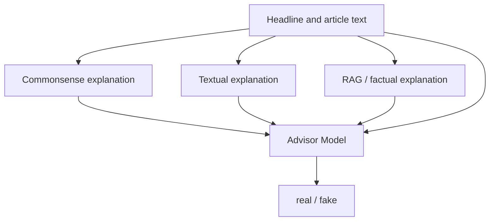

# Advisor Model: News Headline Classification with Explanations and RAG

This project classifies whether a news headline agrees (`real`, class `1`) or disagrees (`fake`, class `0`) with the available evidence. Before classification, it generates three independent explanations for each headline:

1. `evidence_explanation` — a factual explanation based on the article or RAG retrieval;
2. `commonsense_explanation` — an analysis of logic and plausibility;
3. `textual_explanation` — an analysis of style, emotional language, and clickbait.

The headline and the three explanations are encoded by a shared Transformer model. Bidirectional cross-attention then combines their representations, and a classifier produces the final class.

> **Important:** the current source files contain several errors and inconsistencies that must be fixed before running the complete pipeline.

## Project Structure

| File | Purpose |
| --- | --- |
| `bmwGpt2.py` | Indexes documents in ChromaDB and provides interactive hybrid RAG retrieval: vector search + keyword search + Reciprocal Rank Fusion. |
| `generate_explanations.py` | Generates commonsense and textual explanations for an FNC-format dataset. |
| `generate_rag_explanations.py` | Generates factual explanations using ChromaDB; falls back to `articleBody` when the database is unavailable. |
| `prepare_advisor_dataset.py` | Generates or combines explanations, removes target-label leakage, and validates the dataset. |
| `advisor1.py` | Trains the Advisor model and evaluates it on validation and test splits. |
| `test_predict.py` | Generates explanations, loads a trained checkpoint, makes predictions, and calculates metrics. |

## Overview



## Requirements

- Python 3.10 or newer;
- Ollama with a downloaded language model;
- access to Hugging Face for the initial download of `intfloat/multilingual-e5-large`;
- a CUDA-compatible GPU is recommended for training and generation, although the code can run on a CPU;
- sufficient disk space for the LLM, Transformer model, and ChromaDB.

The default `gpt-oss:120b` model requires a large amount of memory. If it does not fit on your hardware, select a smaller model where the script supports `OLLAMA_MODEL` or the `--model` argument.

## Installation

```bash
python -m venv .venv
source .venv/bin/activate
python -m pip install --upgrade pip
pip install \
  pandas numpy requests tqdm python-dotenv \
  torch transformers scikit-learn colorama \
  chromadb langchain-chroma langchain-ollama langchain-core \
  langchain-text-splitters langchain-huggingface \
  pypdf openpyxl
```

Install and start Ollama, then download the selected model:

```bash
ollama pull gpt-oss:120b
ollama serve
```

## Configuration

Create a `.env` file in the project root:

```dotenv
OLLAMA_HOST=http://localhost:11434
OLLAMA_MODEL=gpt-oss:120b

EMBEDDING_MODEL=intfloat/multilingual-e5-large
CHROMA_DIR=chromadb_gemini
CHROMA_COLLECTION=gov_news_gemini

CHUNK_SIZE=1100
CHUNK_OVERLAP=180
INDEX_BATCH_SIZE=96
BATCH_SLEEP_SEC=62
INDEX_MAX_RETRIES=10

PER_QUERY_K=8
FINAL_K=10
KEYWORD_K=20
MAX_CONTEXT_EVIDENCE=8
RETRIEVAL_SCORE_THRESHOLD=1.55
MIN_EVIDENCE_CHUNKS=2
MIN_RRF_SCORE=0.028
```

`generate_explanations.py` uses the hard-coded values `http://localhost:11434/api/generate` and `gpt-oss:120b`. `prepare_advisor_dataset.py` also uses a fixed Ollama address, but accepts the model name through `--model`.

### TSV Dataset

In `prepare_advisor_dataset.py --generate` mode, the TSV file must contain the following columns:

- `title` — the headline;
- `is_fake` — the numeric label.

Verify the meaning of `is_fake`: in the Advisor model, class `1` means `agree`, while in most datasets `is_fake=1` means fake. Invert the labels if necessary.

### Documents for RAG

Place documents in the `data/` directory. The script recursively processes:

- `.csv` and `.xlsx` files — the text column must be named `text`, `content`, `body`, `article`, `news`, `txt`, or `текст`;
- `.txt` files;
- `.pdf` files with an extractable text layer.

For tabular files, an optional identifier can be stored in a column named `id`, `new_id`, `doc_id`, `document_id`, or `news_id`.

## Preparing the RAG Database

Directory structure before indexing:

```text
project/
├── bmwGpt2.py
├── .env
└── data/
    ├── source.csv
    ├── source.pdf
    └── source.txt
```

Run:

```bash
python bmwGpt2.py
```

If the collection is empty, the documents are split into chunks and stored in `chromadb_gemini/`. After indexing, the interactive mode starts:

```text
You: your question
```

Enter `exit` or `quit` to stop. Indexing progress is stored in `.index_checkpoint.json`, so the process can resume after a failure.

## Preparing the Training Dataset

### Option 1: Generate All Explanations from TSV

```bash
python prepare_advisor_dataset.py \
  --generate \
  --train fakenews_dataset/train.tsv \
  --model gpt-oss:120b \
  --output advisor_dataset_final.csv
```

Use `--limit` for a small trial run:

```bash
python prepare_advisor_dataset.py \
  --generate \
  --train fakenews_dataset/train.tsv \
  --limit 100 \
  --output advisor_dataset_sample.csv
```

### Option 2: Generate FNC Explanations Separately

After fixing the `--limit` argument in both generator scripts:

```bash
python generate_explanations.py \
  --stances fakenews/train_stances.csv \
  --bodies fakenews/train_bodies.csv \
  --output final_dataset_for_advisor.csv

python generate_rag_explanations.py \
  --stances fakenews/train_stances.csv \
  --bodies fakenews/train_bodies.csv \
  --output phd_training_dataset_qwen.csv
```

Then combine the files:

```bash
python prepare_advisor_dataset.py \
  --data_a final_dataset_for_advisor.csv \
  --data_b phd_training_dataset_qwen.csv \
  --output advisor_dataset_final.csv
```

The files are combined by row position rather than by identifier. Both files must contain the same examples in the same order.

The final CSV must contain:

```text
claim,evidence_explanation,commonsense_explanation,textual_explanation,label
```

The script removes several explicit verdict tokens from the explanations, checks for possible target-label leakage, and estimates task difficulty using a simple TF-IDF classifier.

## Training the Advisor Model

After fixing `prepare_dataframe()` in `advisor1.py`:

```bash
python advisor1.py \
  --data_a final_dataset_for_advisor.csv \
  --data_b phd_training_dataset_qwen.csv \
  --merge_strategy best \
  --model_name intfloat/multilingual-e5-large \
  --epochs 5 \
  --batch_size 8 \
  --save_path advisor_model_best.pt
```

Useful arguments:

| Argument | Default | Purpose |
| --- | ---: | --- |
| `--max_len` | `256` | Maximum length of each input text. |
| `--lr` | `1e-5` | Learning rate. |
| `--weight_decay` | `0.01` | AdamW L2 regularization. |
| `--freeze_layers` | `6` | Number of lower encoder layers to freeze. |
| `--class_weight` | `1.5` | Weight assigned to the `disagree` class. |
| `--label_smoothing` | `0.1` | Label smoothing for `CrossEntropyLoss`. |
| `--seed` | `42` | Seed used for splitting and training. |

The data is split with stratification into `70% / 15% / 15%`. The best checkpoint is selected by macro F1 on the validation split. After training, the script prints accuracy, macro precision, macro recall, macro F1, a classification report, and a confusion matrix.

## Testing and Prediction

After adding a `label` column to the test DataFrame or deriving it from `Stance`:

```bash
python test_predict.py \
  --stances fakenews/test_stances.csv \
  --bodies fakenews/test_bodies.csv \
  --checkpoint advisor_model_best.pt \
  --model_name intfloat/multilingual-e5-large \
  --output test_predictions.csv
```

For a short test:

```bash
python test_predict.py --limit 50
```

To process a row range:

```bash
python test_predict.py --start 0 --end 1000 --output predictions_0000_1000.csv
```

The output contains the source data, three explanations, the predicted class, and probabilities:

- `pred_label`;
- `pred_veracity`;
- `prob_disagree`;
- `prob_agree`.

## Advisor Model Architecture

1. The headline and each of the three explanations are independently encoded with `AutoModel`.
2. For E5 models, the `query:` prefix is added to the headline and `passage:` to the explanations.
3. The factual, commonsense, and textual representations pass through separate linear projections.
4. Cross-attention is applied in both directions: headline → explanations and explanations → headline.
5. The classifier receives a concatenation of the original headline representation, two attention-based representations, and max pooling over the explanations.
6. The output consists of two logits for the `disagree` and `agree` classes.

## Output Files

| File | Contents |
| --- | --- |
| `final_dataset_for_advisor.csv` | Headline, commonsense explanation, textual explanation, and label. |
| `phd_training_dataset_qwen.csv` | Headline, RAG explanation, and label. |
| `advisor_dataset_final.csv` | Combined and cleaned training dataset. |
| `advisor_model_best.pt` | Best Advisor model weights selected by validation macro F1. |
| `test_predictions.csv` | Predictions, probabilities, and data used to calculate metrics. |
